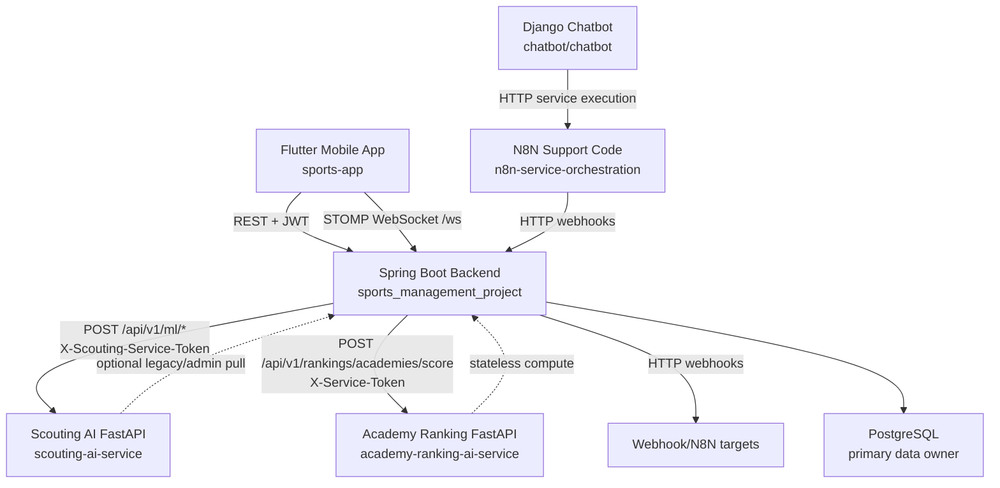

# Architecture Map: Iteration 1 Baseline

## Endpoint Surface
- Spring controller mappings discovered: 499.
- Largest Spring endpoint areas: MVC pages 162, scouting REST 46, admin REST 37, notification REST 24, player REST 24, activity REST 24, sport REST 23.
- Scouting AI FastAPI routes include auth, data sync, ML scoring, scouting architecture and scouter compute routes.
- Academy ranking AI exposes `/health` and `/api/v1/rankings/academies/score`.
- Django chatbot exposes chat UI/API, health, metrics and auth-test URLs.

## Critical Call Paths
- Player/scouting mobile flow: `sports-app` -> `sports_management_project` -> `scouting-ai-service`.
- Academy ranking home flow: `sports-app` or web -> `sports_management_project` -> `academy-ranking-ai-service`, with backend fallback ranking formula.
- Chatbot service flow: user -> `chatbot` -> N8N support/orchestration -> backend/service webhook -> chatbot response.
- Real-time flow: `sports-app` -> Spring STOMP `/ws` for chat and notifications.

## Hotspot Candidates
- Spring uses JPA heavily and has 499 mappings; N+1/query-plan auditing needs targeted endpoint profiling.
- Spring-to-AI and webhook clients are split across multiple ad-hoc HTTP clients with inconsistent timeout/retry/fallback behavior.
- Flutter analyzer warnings cluster around async context use, null-safety dead code, unused imports/fields, file naming and deprecated `withOpacity`.
- Seed JSON under Spring resources is very large and contains realistic PII-like records, known accounts and generated ML training data.

## Iteration 2 Architecture Notes
- Service topology is unchanged.
- Production runtime configuration is stricter: backend requires `JWT_SECRET`; FastAPI compute services require service tokens outside `dev`, `local`, and `test`.
- Backend artifact packaging no longer includes the large demo seed file under `Files/Data/data.json`.
- N8N service selection now treats short keywords as exact word/phrase matches to reduce accidental service invocation from general chat.
